# Campus Clash - Gestión de Torneo Relámpago de Videojuegos

Solución desarrollada en **Java** para administrar un torneo universitario de videojuegos,
implementando estructuras de datos lineales y una representación mediante árbol para el cuadro eliminatorio.

### 📂 Ubicación del Código
El código fuente principal con toda la lógica del programa se encuentra en la siguiente ruta:
`src > estructura5 > Estructura5.java`

---

## 🛠️ Estructuras de Datos Implementadas

- **ArrayList<Equipo>** – Almacena los cuatro equipos participantes con acceso indexado.
- **Queue (LinkedList)** – Gestiona el check-in respetando el orden de llegada (FIFO) para formar automáticamente las semifinales.
- **PriorityQueue<Incidente>** – Atiende los incidentes técnicos según nivel de urgencia; ante empate, por orden de registro.
- **Stack<CambioResultado>** – Permite deshacer el último resultado registrado aplicando el principio LIFO.
- **Árbol con nodos (Nodo)** – Representa el cuadro eliminatorio: nodo raíz = Final, hijos = Semifinal 1 y Semifinal 2.

---

## 💻 Capturas de la Implementación (Consola)

A continuación se muestran las pruebas de ejecución del sistema, demostrando el flujo completo del torneo:

### Imágenes 1, 2, 3, 4 y 5 – Registro de equipos y check-in
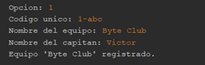

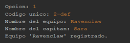

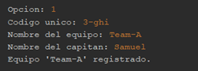

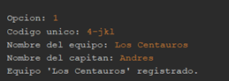

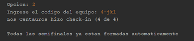

### Imágenes 6, 7, 8, 9, 10, 11, 12 y 13 – Incidentes, atención y Deshacer
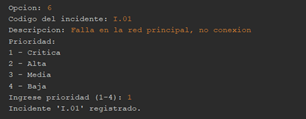

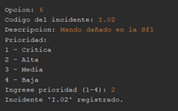

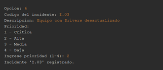

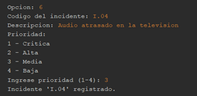

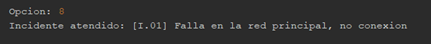

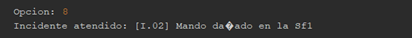

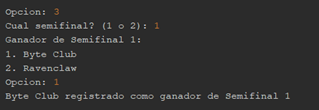

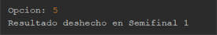

### Imagen 14 – Visualizacion del Bracket o cuadro del Torneo
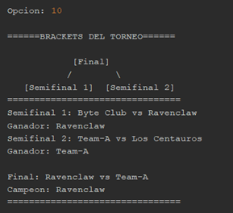

---

> **Nota para el profesor:** He subido el proyecto completo a este repositorio de GitHub
> para garantizar la visualización del código con total claridad y complementar la
> documentación técnica entregada.

---

**Desarrollado por:** Víctor Manuel Cordoba Larez  
**Carrera:** Ingeniería Informática  
**Materia:** Estructura de Datos  
**Institución:** Corporación Universitaria Lasallista
